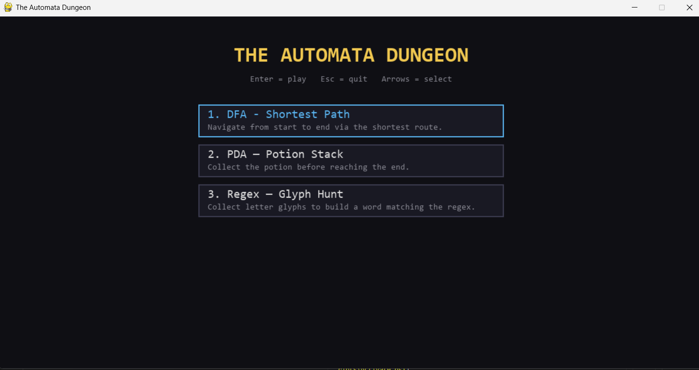
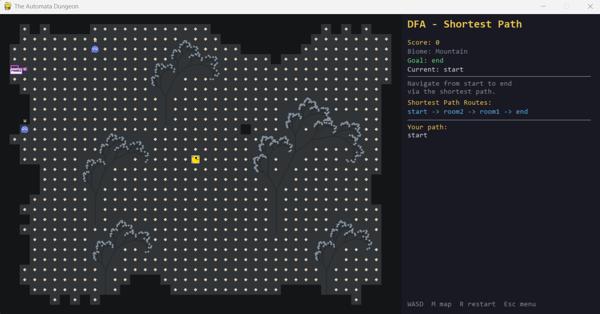
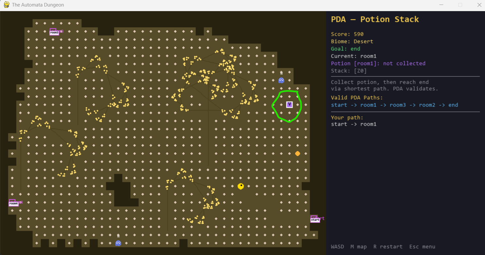
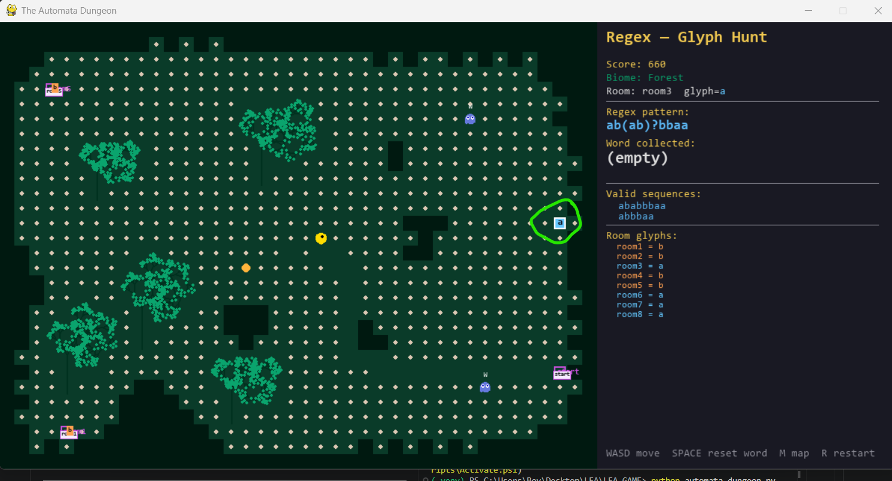
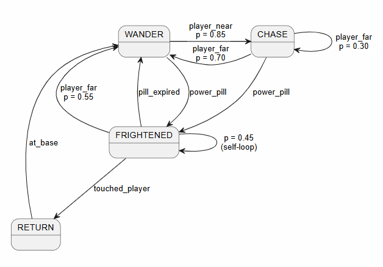
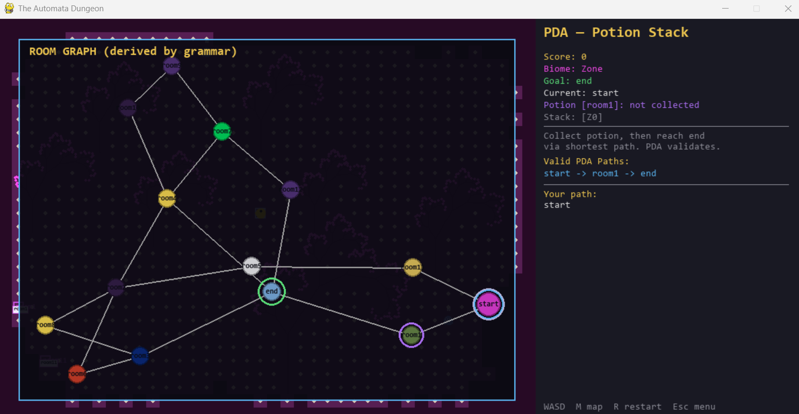

<div align="center">

# The Automata Dungeon

**A Pac-Man dungeon where the maze *is* the automaton.**

[](https://www.python.org/)
[](https://pyga.me/)

</div>

---

Three levels. Three automata. One dungeon generated fresh every run.

In each level the room graph **is** the automaton: rooms are states, walking through a portal emits a symbol, and the win condition is exactly the acceptance condition of that automaton. Level 1 is a DFA you must traverse along a shortest path. Level 2 is a PDA that tracks whether you collected a required item. Level 3 generates a regular expression from the dungeon layout and asks you to collect letter glyphs in a matching order.

The dungeon itself is built by three layered procedural systems — a graph grammar, cellular automata, and L-systems — so no two runs share the same map, biome distribution, or plant shapes.



---

## Contents

- [Quick Start](#quick-start)
- [Controls](#controls)
- [Levels](#levels)
- [Ghost AI — Probabilistic FSM](#ghost-ai--probabilistic-fsm)
- [Procedural Generation](#procedural-generation)
  - [Graph Grammar](#graph-grammar)
  - [Cellular Automata](#cellular-automata)
  - [L-Systems](#l-systems)
- [Output Files](#output-files)

---

## Quick Start

```bash
pip install pygame-ce
python automata_dungeon.py
```

Python 3.10 or later is required. No other dependencies.

---

## Controls

| Input | Action |
|-------|--------|
| `W A S D` or arrow keys | Move |
| `M` | Toggle minimap |
| `R` | Restart level |
| `Esc` | Main menu |
| `Space` | Reset collected word (Level 3) |

---

## Levels

### Level 1 — DFA · Shortest Path



The dungeon graph encodes a **Deterministic Finite Automaton**. Every room is a state; entering a room via a portal emits the symbol for that room. The transition function `δ` is defined only for edges that lie on at least one shortest path from START to END — any detour produces a symbol the DFA cannot consume, causing rejection and ending the run.

```
M = (Q, Σ, δ, q₀, F)

  Q   — one state per room
  Σ   — one symbol pᵣ per room r
  δ   — shortest-path edges only
  q₀  — start room
  F   — { end room }
```

The sidebar displays every valid shortest-path route and your current path in real time. `configDFA.txt` is written with the full automaton and traversal result after every run.

---

### Level 2 — PDA · Potion Stack



The dungeon graph encodes a **Pushdown Automaton**. One room contains a potion (`V`). Collecting it pushes the symbol `X` onto the stack; a silent ε-transition at END pops `X` and moves to an explicit ACCEPT state. Arriving at END with an empty stack is rejected.

```
M = (Q, Σ, Γ, δ, q₀, Z₀, F)

  Γ   — { X, Z₀ }
  F   — { ACCEPT }

Transitions
  (q,    p<room>,  ε  →  <room>,  ε )   walk to any adjacent room
  (pot,  pickup,   ε  →  pot,     X )   collect potion → push X
  (end,  ε,        X  →  ACCEPT,  ε )   X on stack → accept

Stack along a winning path
  start      potion room      end        ACCEPT
  [Z₀]  →   [Z₀, X]   →  [Z₀, X]  →  [Z₀]
               ↑ pickup               X popped by ε-move
```

The sidebar shows the live stack and whether the potion has been picked up. `configPDA.txt` is written with the full PDA and stack trace.

---

### Level 3 — Regex · Glyph Hunt



Each ROOM is assigned a glyph (`a` or `b`). Stepping on a room's glyph tile appends its letter to your collected word. The game enumerates every simple path through the dungeon, maps each to its glyph sequence, and compresses the set into a regular expression. The level is won the moment `re.fullmatch(pattern, word)` succeeds.

```
Step 1  Assign a symbol ∈ {a, b} to every ROOM node.

Step 2  Enumerate simple paths (BFS shortest-length + up to 3 extra hops,
        capped at 48 paths). Map each path to its glyph sequence.

Step 3  Compress the sequence set to a regex.

        Example sequences  { "a", "b", "aa" }
        Common prefix/suffix: none
        Alternation of middles: a(a)? | b
        Final pattern: a(a)?|b

Step 4  Build an ε-NFA with one linear chain per unique sequence,
        all reachable from q₀ via ε-transitions.

        q0 ──ε──▶ q0c0 ──a──▶ q0c1 ✓
        q0 ──ε──▶ q1c0 ──b──▶ q1c1 ✓
        q0 ──ε──▶ q2c0 ──a──▶ q2c1 ──a──▶ q2c2 ✓
```

`Space` resets the collected word without restarting the level. The NFA, room-symbol map, valid sequences, and collection log are written to `configREGEX.txt`.

---

## Ghost AI — Probabilistic FSM

Each ghost is controlled by a **Probabilistic Finite State Machine** — an FSM whose transition function returns a probability distribution over next states rather than a single deterministic target.

```
M = (Q, Σ, δₚ, q₀)

  Q   = { WANDER, CHASE, FRIGHTENED, RETURN }
  Σ   = { player_near, player_far, power_pill,
           touched_player, pill_expired, at_base }
  δₚ  : Q × Σ → Dist(Q)
  q₀  = WANDER
```

### State Diagram



### Transitions

| State | Event | Next | p |
|-------|-------|------|---|
| WANDER | `player_near` | CHASE | 0.85 |
| WANDER | `player_near` | WANDER | 0.15 |
| WANDER | `player_far` | WANDER | 1.00 |
| WANDER | `power_pill` | FRIGHTENED | 1.00 |
| CHASE | `player_near` | CHASE | 1.00 |
| CHASE | `player_far` | WANDER | 0.70 |
| CHASE | `player_far` | CHASE | 0.30 |
| CHASE | `power_pill` | FRIGHTENED | 1.00 |
| FRIGHTENED | `touched_player` | RETURN | 1.00 |
| FRIGHTENED | `pill_expired` | WANDER | 1.00 |
| FRIGHTENED | `player_far` | WANDER | 0.55 |
| FRIGHTENED | `player_far` | FRIGHTENED | 0.45 |
| RETURN | `at_base` | WANDER | 1.00 |

### Movement

| State | Colour | Moves every | Strategy |
|-------|--------|-------------|----------|
| WANDER | Blue | 10 frames | Random walk; prefers not to reverse |
| CHASE | Red | 7 frames | Greedy toward player (Manhattan) |
| FRIGHTENED | Dark blue / flashing | 12 frames | Greedy away from player |
| RETURN | Grey (eyes only) | 5 frames | BFS through portals to spawn |

Ghosts cross room portals **only** in RETURN state. In all other states they are confined to their current room. FRIGHTENED starts flashing during its last 120 frames as a warning to the player.

---

## Procedural Generation

Three systems run in sequence to build each dungeon.

```
  Graph Grammar  →  room graph (which rooms exist, how they connect)
        │
        ▼
  Cellular Automata  →  floor layout for every room
        │
        ▼
  L-Systems  →  vegetation placed inside every room
```

---

## Graph Grammar



The room graph is derived by repeatedly applying rewrite rules to an initial two-node graph.

```
GG = (G₀, R)

  G₀  — single edge:  START ── END
  R   — { r₁: edge → line,  r₂: edge → triangle,  r₃: triangle → square }
```

At each iteration the algorithm checks whether a triangle exists (50 % chance of applying r₃ if so); otherwise it picks a random edge and applies r₁ (60 %) or r₂ (40 %). The process repeats for up to 12 iterations.

---

### r₁ · Edge → Line

Inserts one new room onto an existing corridor.

```
  Before          After

  A ───── B       A ──── Z ──── B
                         ↑
                      new room

  Remove  A──B
  Add     A──Z   Z──B
```

---

### r₂ · Edge → Triangle

Adds a parallel alternative path between two rooms.

```
  Before          After

  A ───── B       A ───── B
                   ╲     ╱
                      Z 
                      ↑
                   new room

  Keep   A──B
  Add    A──Z   Z──B
```

---

### r₃ · Triangle → Square

Expands a three-cycle into a four-cycle by removing one edge and inserting a room on the gap.

```
  Before          After

     B                  B 
    /  \              /   \
   A ── C    →       A     C
                      ╲   ╱
  (triangle)            W
                        ↑
                    new room,
                  inserted on A──C

  Pick one edge of the triangle (e.g. A──C)
  Remove  A──C
  Add     A──W   W──C
```

---

### Derivation Example

```
  iter 0   START ──────────────────── END

  iter 1   START ── R1 ── END                            r₁ on START──END

  iter 2   START ── R1 ── END                            r₂ on R1──END
                     ╲   ╱
                       R2

  iter 3   START ── R1 ── R3 ── END                      r₁ on R1──END
                      ╲       ╱
                       ╲     ╱
                         R2
  ...
```

After derivation each node receives a randomly chosen biome, a cellular-automata floor, and an L-system forest. Portal tiles are placed on floor cells near the boundary facing each graph neighbour, with a minimum separation of 6 tiles from the spawn point and each other.

---

## Cellular Automata

Each room's floor is an independent cellular automaton on a 40 × 30 grid.

### Rule

```
  N₈(x, y)   — the 8 Moore-adjacent neighbours of tile (x, y)

  walls(x,y)  = |{ n ∈ N₈(x,y) : n = WALL }|

               ┌  WALL    if  walls(x, y) ≥ 5
  G'(x, y) =  │
               └  FLOOR   otherwise
```

The border ring is permanently WALL. The rule is applied synchronously — all tiles update simultaneously from the previous generation — for 5 iterations.

### Iteration Sequence

```
  Iteration 0 — random seed, P(WALL) = 0.45

  ████████████████████████████
  ██·█·███·██·█···███·██·█·██
  █·██··██·█·█·██·██··█·█··██
  ██·█·█··█·██··█·███·█··██·█
  ████████████████████████████

  Iteration 2 — noise consolidates into patches

  ████████████████████████████
  █████·····················██
  ████·····················███
  █████·····················██
  ████████████████████████████

  ...
```

### Post-Processing

**Largest component.** BFS identifies every connected floor region; all but the largest are discarded. This guarantees a fully connected interior.

**Spawn point.** The tile closest to the centroid of the surviving region becomes the spawn — always near the geometric centre of the open area.

---

## L-Systems

Trees inside rooms are rendered by a parametric L-system interpreted as turtle graphics.

### Definition

```
L = (V, ω, P)

  V  — alphabet  { 0, 1, [, ] }
  ω  — axiom  "0"
  P  — production rules, applied in parallel each iteration
```

| Symbol | Turtle action |
|--------|---------------|
| `1` | Draw segment forward — trunk (no leaf) |
| `0` | Draw segment forward — leaf (dot at tip) |
| `[` | Push state · turn left `angle`° · divide length by 1.25 |
| `]` | Pop state · turn right `angle`° |

Initial heading is −90° (upward). Each biome has its own rules, angle, and segment length.

### OAK\_TREE Derivation

```
Rules   1 → 11        (trunk doubles every pass)
        0 → 1[0]0[0]0  (leaf expands into branching sub-tree)

n=0     0

n=1     1[0]0[0]0
        │ │ │ │ └── right leaf
        │ │ │ └──── branch right
        │ │ └────── centre leaf
        │ └──────── branch left
        └────────── trunk

n=2     11[1[0]0[0]0]1[0]0[0]0[1[0]0[0]0]1[0]0[0]0
        ↑↑  └───────┘            └───────┘
        doubled trunk  each "0" from n=1 is now fully expanded
```

### Plant Catalogue

| Biome | Plant | `0 →` | `1 →` | Angle |
|-------|-------|--------|-------|------:|
| Forest | Oak | `1[0]0[0]0` | `11` | 28° |
| Desert | Cactus | `10[0]0` | `11` | 18° |
| Tundra | Lichen | `0[0]0` | `1` | 24° |
| Swamp | Willow | `1[0]1[0]0` | `11` | 32° |
| Jungle | Palm | `1[0]1[0]1` | `11` | 20° |
| Ocean | Kelp | `10` | `11` | 12° |
| Volcano | Obsidian Moss | `0[0]0[0]` | `1` | 26° |
| Mountain | Pine | `1[0]1[0]0` | `11` | 24° |
| Canyon | Tumbleweed | `1[0]0[0]1` | `1` | 34° |
| Glacier | Arctic Poppy | `1[0]0` | `11` | 22° |
| Cave | Bioluminescent Mushroom | `1[0]0` | `1` | 28° |
| Lab | Petri Culture | `0[0]0` | `1` | 18° |
| Core | Ivy | `10[0]0` | `11` | 26° |
| Void | Withered Root | `1[0]0` | `1` | 20° |
| Zone | Fern | `1[0]1[0]0` | `11` | 30° |
| Grid | Bamboo | `10` | `111` | 12° |

All plants share axiom `ω = "0"`. `1 → 1` keeps trunk length constant; `1 → 11` doubles it each pass; `1 → 111` triples it (Bamboo: very tall, no branching).

### Placement — ForestPlanner

Trees are placed with a **weighted candidate pool** and a BFS connectivity check that guarantees portals remain reachable after planting.

```
1. Density field
   D[x][y] = wall neighbours / 8
   Tiles near walls score higher and are preferred.

2. Clearings
   Up to 3 open-centre spots (D < 0.25, pairwise distance ≥ 6)
   are reserved as tree-free walking corridors.

3. Candidate pool
   weight(tile) = 0.2 + D[tile]
   Excludes spawn, portals, and their 1-tile buffers.

4. Plant loop
   ① Sample a tile by weight.
   ② Derive the L-system tree; compute its tile footprint.
   ③ Reject if footprint touches a wall.
   ④ Reject if footprint overlaps reserved or already-blocked tiles.
   ⑤ Reject if any footprint tile lies in a passage of width ≤ 1.
   ⑥ Reject if BFS(spawn → portals, blocked ∪ footprint) fails.
   ⑦ Accept — record tree, add footprint to blocked set.
   Repeat until target count is reached or the attempt budget runs out.
```

---

## Output Files

Every level run regenerates its file with the procedurally built automaton and appends the player's traversal result. The `[Section] … [Stop]` format is parsed by `automata_validator.py`.

| File | Level | Contents |
|------|-------|----------|
| `configDFA.txt` | 1 | Sigma, states, transitions, grammar audit log, traversal result |
| `configPDA.txt` | 2 | Sigma, gamma, states, transitions, potion room, stack trace, traversal result |
| `configREGEX.txt` | 3 | NFA, room-symbol map, valid sequences, collection log |
